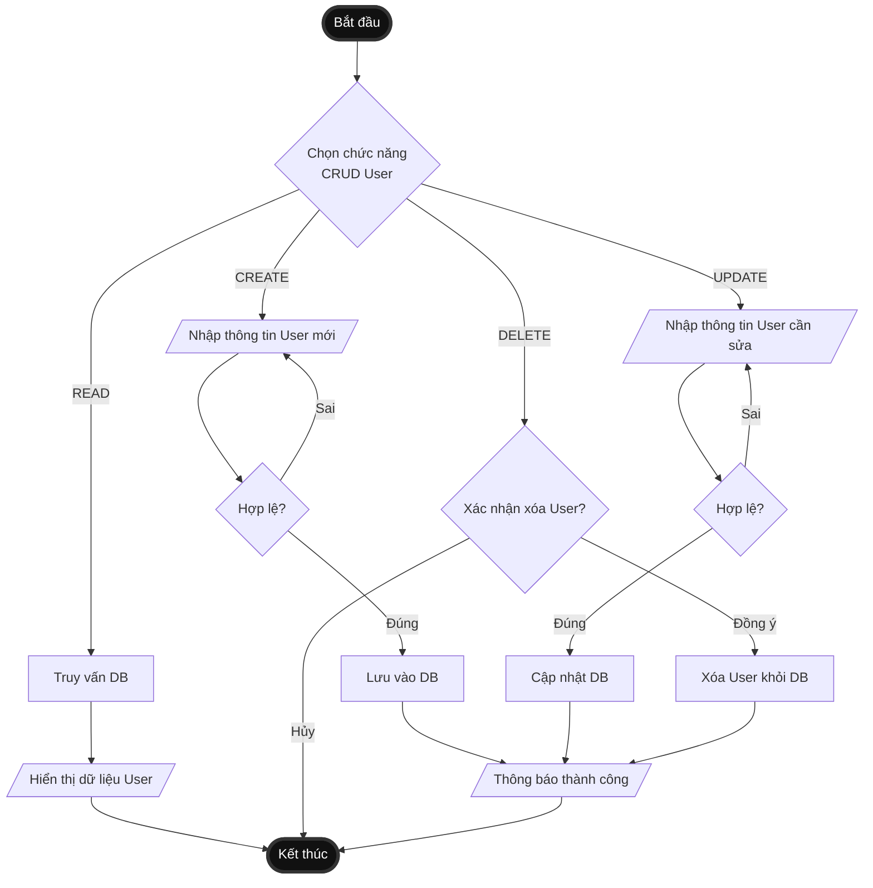

# nestNode
## Server

```
npm i -g @nestjs/cli

nest new server

npm install --save typeorm mysql2
```
## Client

```
npx create-react-app client

```

---

## Bài tập (Assignments)

**Yêu cầu 1:** Thực hiện API CRUD (Create, Read, Update, Delete).
- Đã cài đặt backend quản lý khách hàng tại folder `server/src/customer` (sử dụng NestJS).
- Các API endpoints chính của Customer:
  - `GET /customers` : Xem danh sách
  - `GET /customers/:id` : Xem chi tiết
  - `POST /customers` : Thêm mới
  - `PUT /customers/:id` : Cập nhật
  - `DELETE /customers/:id` : Xóa

**Yêu cầu 2:** Sinh viên vẽ lưu đồ thuật toán (Activity Diagram) của CRUD (2 điểm).
- Dưới đây là mã nguồn `Mermaid` để sinh ra lưu đồ Activity Diagram tóm gọn cho chức năng CRUD User.
- Bạn có thể copy mã này dán vào trang [Mermaid Live Editor](https://mermaid.live/) để xuất ảnh PNG/SVG. Github cũng hỗ trợ hiển thị trực tiếp.

<details>
<summary>Nhấn để mở xem code Mermaid (Activity Diagram)</summary>


</details>